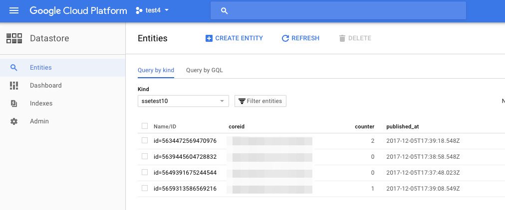
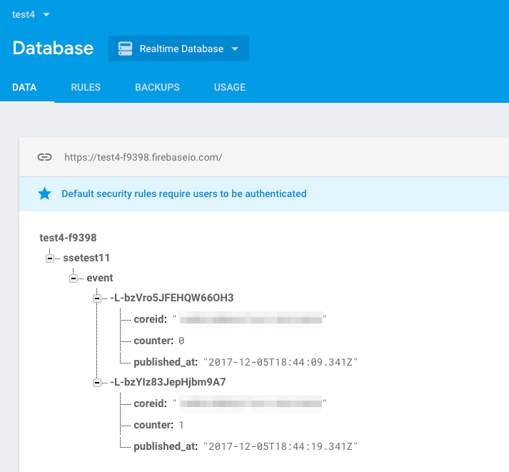
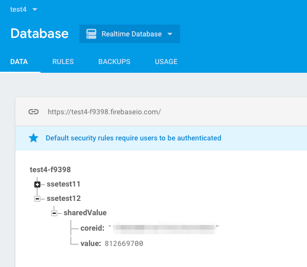

# SSE Examples

[Server-Sent-Events](https://developer.mozilla.org/en-US/docs/Web/API/Server-sent_events/Using_server-sent_events) (SSE) is a great alternative to using webhooks to process data sent from Particle Photon, P1, and Electron devices.

Webhooks make outgoing HTTP connections to an external server each time an event is received by the cloud.

SSE, on the other hand, has your server make an outgoing encrypted TLS/SSL connection to the Particle cloud and keeps the connection open. The Particle cloud can then push events down this connection in near real time.

- Faster response time.
- Lower request overhead on your server.
- Can receive events at full 1 event per second publish rate per device, instead of the 12 webhook calls per minute maximum.
- Your server can be behind a firewall, including NAT.
- Your server can does not require a DNS name or a fixed IP address.
- The connection is encrypted without requiring a TLS/SSL server certificate for your server.

The examples here use node.js because Javascript/node is an easy way to implement not only local servers, but also servers hosted on Google or Amazon. The particle-api-js makes it even easier.

SSE doesn't require node, however. You could implement your server in the language of your choice, such as Python, Java, etc. if you wanted to.

## Getting started

- [Install node.js](https://nodejs.org/)

The current LTS version is usually a good option for most users. At the time of writing it was 8.9.1, but a newer version is OK. It should work as far back as 4.3.2, but you shouldn't use an older version than that.

You can check your version of node by using the command:

```
node --version
```

- Download the source from Github

The example source and this tutorial are here:

[https://github.com/rickkas7/sse-examples](https://github.com/rickkas7/sse-examples)

For an explanation of how to flash firmware and run the examples, see the 01 - Simple data printer example below.


## 01 - Simple data printer

This example isn't really all that useful - it just prints out the events as they arrive. But it's about as simple of an example as you can make, so it's a good first example.

The Particle device firmware is in the firmware directory in the 01-simple-data-printer directory. The easiest way to flash it is using the Particle CLI compiler:

```
$ cd 01-simple-data-printer/firmware
$ particle flash test4 .
```

Replace test4 with the name of your device. Note the dot (period) at the end of the line, separated by a space, that indicates it should build the current directory (firmware).

Makes sure you edit the config.json file! It must contain a valid access token for your account. One way you can get an access token is to log into [https://build.particle.io](https://build.particle.io) and click on the gear icon (Settings) and copy and paste your access token. Make sure you keep this secure and don't check it into public version control systems like Github, as the access token will grant access to your account!

```
{
	"authToken":"fe12630d2dbbd1ca6e8e28bd5a4b953dd3f1c53f",
	"deviceFilter":"mine"
}
```

(The example files contain strings that look like access tokens and device IDs, but they're all fake and can't be used unless edited.)

The deviceFilter is which devices to log. Normally you set it to the literal string "mine" for your device. It could also be a specific device ID, but this not normally necessary (or even desirable) for SSE.

The first time you build an example you need to retrieve the dependencies:

```
$ cd 01-simple-data-printer
$ npm install
```

Once you do that, you can run the server locally:

```
$ npm start

> 01-simple-data-printer@0.0.1 start /Users/rickk/Documents/src/sse-examples/01-simple-data-printer
> node server.js

Event:  { data: '{"counter":0}',
  ttl: 60,
  published_at: '2017-12-05T13:43:16.054Z',
  coreid: '28c8b06ce19895f2178193b0',
  name: 'sse-examples-01' }
Event:  { data: '{"counter":1}',
  ttl: 60,
  published_at: '2017-12-05T13:43:26.055Z',
  coreid: '28c8b06ce19895f2178193b0',
  name: 'sse-examples-01' }
Event:  { data: '{"counter":2}',
  ttl: 60,
  published_at: '2017-12-05T13:43:36.054Z',
  coreid: '28c8b06ce19895f2178193b0',
  name: 'sse-examples-01' }
```

Every 10 seconds the Photon or Electron will publish and event and it will print out.

If this doesn't work you should log into [https://console.particle.io](https://console.particle.io) and check the Event Log tab to see if the events are getting generated.

## 02 - Write to a MySQL database

There is no new firmware for this example; you can use the Particle device firmware from example 01 - simple data printer.

This assumes you have access to a MySQL server on your computer already. 

I created a new account and database using the MySQL command line, but you can use a different tool if you prefer:

```
$ mysql -uroot -pSECRET_ROOT_PW
mysql> CREATE USER 'ssetest'@'%' IDENTIFIED BY '0jAFvK18EozG';'
Query OK, 0 rows affected (0.03 sec)

mysql> grant all privileges on ssetest.* to 'ssetest'@'%' with grant option;
Query OK, 0 rows affected (0.01 sec)

mysql> create database ssetest;
Query OK, 1 row affected (0.01 sec)

mysql> use ssetest;
Database changed

mysql> create table example02 (id INT NOT NULL AUTO_INCREMENT, device VARCHAR(34), ts DATETIME, counter INT, UNIQUE INDEX(id));
Query OK, 0 rows affected (0.07 sec)
```

Install the dependencies; you only need to do this once:

```
$ cd 02-simple-mysql
$ npm install
```

You'll need to edit the config.json file. There are more things to configure this time:

```
{
	"authToken":"fe12630d2dbbd1ca6e8e28bd5a4b953dd3f1c53f",
	"deviceFilter":"mine",
	"mysql_host":"localhost",
	"mysql_user":"ssetest",
	"mysql_password":"0jAFvK18EozG",
	"mysql_database":"ssetest"
}
```

And then you can run the server:

```
$ npm start

> 02-mysql@0.0.1 start /Users/rickk/Documents/src/sse-examples/02-simple-mysql
> node server.js

Connected to database
event:  { data: '{"counter":0}',
  ttl: 60,
  published_at: '2017-12-05T14:51:03.214Z',
  coreid: '28c8b06ce19895f2178193b0',
  name: 'sse-examples-01' }
inserted: INSERT INTO example02 (device, ts, counter) VALUES ('28c8b06ce19895f2178193b0', NOW(), 0)
event:  { data: '{"counter":1}',
  ttl: 60,
  published_at: '2017-12-05T14:51:13.214Z',
  coreid: '28c8b06ce19895f2178193b0',
  name: 'sse-examples-01' }
inserted: INSERT INTO example02 (device, ts, counter) VALUES ('28c8b06ce19895f2178193b0', NOW(), 1)
```

And then you can verify that the entries were added from the MySQL console tool:

```
mysql> select * from example02;
+----+--------------------------+---------------------+---------+
| id | device                   | ts                  | counter |
+----+--------------------------+---------------------+---------+
|  1 | 28c8b06ce19895f2178193b0 | 2017-12-05 09:51:03 |       0 |
|  2 | 28c8b06ce19895f2178193b0 | 2017-12-05 09:51:13 |       1 |
|  3 | 28c8b06ce19895f2178193b0 | 2017-12-05 09:51:23 |       2 |
|  4 | 28c8b06ce19895f2178193b0 | 2017-12-05 09:51:33 |       3 |
+----+--------------------------+---------------------+---------+
4 rows in set (0.00 sec)
```


## 10 - Google cloud to Cloud Datastore

The earlier examples use a local node.js server. These examples are nice in that they can either be run locally, or they can be deployed to run in the Google cloud!

### Setting up Google App Engine

This is done using [Google App Engine](https://cloud.google.com/appengine/). It's a little complicated to set up at first, but makes it really simple to deploy server after that. 

And, since you get 28 instance hours of app engine per day in the free tier, if you don't use it too much it's still free. And, once you beyond simple samples, there is so much customization you can do, not only for storing the data, but also retrieving and displaying it.

There are a bunch of options when using app engine, but since we're using node.js, a [flexible environment node.js](https://cloud.google.com/appengine/docs/flexible/nodejs/) configuration is what we need.

Running through the [quickstart](https://cloud.google.com/appengine/docs/flexible/nodejs/quickstart) will get the prerequisites installed and functioning. If you want to get a feel for how this works, go through the hello world how-to, which is how I figured out how to do this. 

Make sure you install the [Google Cloud SDK](https://cloud.google.com/sdk/docs/) on your computer. This provides local command line tools on your computer so you can deploy the code. There are easy installers for Windows, Mac and Linux.

Even if you don't plan to deploy to the Google cloud right now, it's a handy template for creating local servers, too. And it makes it much easier to authenticate to Google cloud servers, so you can mix-and-match a local node.js server and a Google cloud datastore or Firebase database in the cloud, too.

### Setting up this project

From the [Google cloud console](https://console.cloud.google.com/home/dashboard) I created a new project. This was test4. Note the project ID, which in my case was test4-188115. It's the project name with a random number after it.

You need to authenticate your computer to run the example locally.

```
$ gcloud auth application-default login
```

Get a list of project and make sure the correct one is selected:

```
$ gcloud config list
```

I needed to change mine, so I used the command:

```
$ gcloud config set project test4-188115
```

This project will be using the Google Cloud Datastore, the Google NoSQL database. (Other options include Google Cloud SQL and MongoDB, but we won't be using those here.)

Enable Datastore in your project in the [Google console](https://console.cloud.google.com/datastore/setup).

When you set up a new data store, you'll need to set a region for your data store. It takes a minute or two to set up.

You don't have to set up an entity ahead of time since we don't need indexing or other structures for this test. 

Then edit the config.json file:

```
{
  "GCLOUD_PROJECT": "test4-188115",
  "AUTH_TOKEN":"fe12630d2dbbd1ca6e8e28bd5a4b953dd3f1c53f",
  "DEVICE_FILTER":"mine",
  "DATA_STORE_ENTITY_KIND":"ssetest10"
}
```

The GCLOUD\_PROJECT is the project we created above in the Google console.

The AUTH\_TOKEN is your Particle authorization or access token.

The DEVICE\_FILTER is normally set to the string "mine" so it will log events from any of your devices that match the event name template. You could also specify a single device ID here instead.

The DATA\_STORE\_ENTITY\_KIND is what we create above.

### Run locally

To run locally, you just need to install the dependencies, only once in each example directory:

```
npm install
```

If it installs correctly, you can run it:

```
npm start
```

The logs are displayed in the terminal window you ran it from. You can stop it with Ctrl-C.

You can view the data from the [Google Cloud Datastore Entities viewer](https://console.cloud.google.com/datastore/entities/query) web page.



### Deploying to the cloud

If you haven't already done so, go to the [Google cloud console](https://console.cloud.google.com) and enable the Google App Engine Flexible Environment.

To deploy your app, instead of using npm start, you use:

```
gcloud app deploy
```

And to read the logs once deployed:

```
gcloud app logs read
```

Note that this is a very slow process to spin up a new app engine, so during development you'll definitely want to run locally.

Also make sure you stop it when you're done with it, or before deploying a new one. Deploying it again creates a new one and does not stop the old one!

## 11 - Google cloud to Firebase

Even though Firebase is part of Google, some settings are in the separate [Google firebase console](https://console.firebase.google.com), though some settings, like for your project, are in the cloud console.

There is no special device firmware for this example; it uses the firmware from the first example.

You'll need to add Firebase support to your project in order to use Firebase. The setting is in the Firebase console in Project - Settings - Service Accounts.

Click the Generate New Private Key button at the bottom of the Firebase Admin SDK section of the Service Accounts tab. This will generate a JSON file containing your key information.

Put this file in the 11-google-firebase directory.

Then edit the config.json file:

```
{
  "GCLOUD_PROJECT": "test4-188115",
  "AUTH_TOKEN":"fe12630d2dbbd1ca6e8e28bd5a4b953dd3f1c53f",
  "DEVICE_FILTER":"mine",
  "FIREBASE_CERT_FILE":"test4-f9398-firebase-adminsdk-cknpd-00a9ab49f3.json",
  "FIREBASE_DATABASE":"test4-f9398",
  "FIREBASE_PARENT":"ssetest11",
  "FIREBASE_CHILD":"event"
}
```

The GCLOUD\_PROJECT is the project we created above in the Google console.

The AUTH\_TOKEN is your Particle authorization or access token.

The DEVICE\_FILTER is normally set to the string "mine" so it will log events from any of your devices that match the event name template. You could also specify a single device ID here instead.

The DATA\_STORE\_ENTITY\_KIND is what we create above.

The FIREBASE\_CERT\_FILE is the filename of the JSON cert file we just downloaded. It must be in the same directory as config.json.

The FIREBASE\_DATABASE is the database ID for Firebase, which is not the same as your GCLOUD\_PROJECT!

The FIREBASE\_PARENT and FIREBASE\_CHILD affect how the entries are stored in Firebase.

Then install the dependencies and run it:

```
npm install
npm start
```

You'll want to observe the output from a lot of things to get the full effect:

- The terminal window that you ran npm start from, which has the server console output
- A serial monitor for your Photon or Electron, showing the device logs.
- The Event Logs view from https://console.particle.io web page.
- The Firebase database viewer.

For the latter, go to the [Firebase console](https://console.firebase.google.com), select your project, then Database, then Realtime Database. 




## 12 - Firebase Share Values 

This example is similar to the previous one, except instead of storing multiple rows of data, it has a single value that can be managed from multiple devices.

The code is intended to be flashed to any number of Photon or Electron devices. When the SETUP/MODE button is clicked, it publishes a random value to the cloud.

The server stores this value, and the device ID of the device that generated it, in a Firebase realtime database.

The server also sets up a monitor for this database child, so whenever it's modified, the new value is published to the Particle devices. So when you click the button in one, all of the other devices immediately get updated with the new value!

There is device firmware for this example. To run it:

```
cd 12-firebase-shared-value/firmware
particle flash test4 .
```

Replace test4 with the name of your Particle Photon or Electron. You should flash this to two or more devices.

Copy the private key file you created in the previous example to the 12-firebase-shared-values directory as well.

Edit the config.json file:

```
{
  "GCLOUD_PROJECT": "test4-188115",
  "AUTH_TOKEN":"fe12630d2dbbd1ca6e8e28bd5a4b953dd3f1c53f",
  "DEVICE_FILTER":"mine",
  "FIREBASE_CERT_FILE":"test4-f9398-firebase-adminsdk-cknpd-00a9ab49f3.json",
  "FIREBASE_DATABASE":"test4-f9398",
  "FIREBASE_PARENT":"ssetest12"
}
```

The GCLOUD\_PROJECT is the project we created above in the Google console.

The AUTH\_TOKEN is your Particle authorization or access token.

The DEVICE\_FILTER is normally set to the string "mine" so it will log events from any of your devices that match the event name template. You could also specify a single device ID here instead.

The DATA\_STORE\_ENTITY\_KIND is what we create above.

The FIREBASE\_CERT\_FILE is the filename of the JSON cert file we just downloaded. It must be in the same directory as config.json.

The FIREBASE\_DATABASE is the database ID for Firebase, which is not the same as your GCLOUD\_PROJECT!

The FIREBASE\_PARENT and affect how the entries are stored in Firebase.

Then install the dependencies and run it:

```
npm install
npm start
```

You'll want to observe the output from a lot of things to get the full effect:

- The terminal window that you ran npm start from, which has the server console output
- A serial monitor for your Photon or Electrons, showing the device logs. You may want two or more of these.
- The Event Logs view from https://console.particle.io web page.
- The Firebase database viewer.

For the latter, go to the [Firebase console](https://console.firebase.google.com), select your project, then Database, then Realtime Database. 



Here are two serial logs from my test:

```
sending: {"value":1085377743}
value=1191391529 coreid=1f0030001647353236343033
sending: {"value":1270216262}
value=1270216262 coreid=28c8b06ce19895f2178193b0
value=812669700 coreid=1f0030001647353236343033
```

And from the other device:

```
sending: {"value":1191391529}
value=1191391529 coreid=1f0030001647353236343033
value=1270216262 coreid=28c8b06ce19895f2178193b0
sending: {"value":812669700}
value=812669700 coreid=1f0030001647353236343033
```

That's showing that when you press SETUP/MODE button on the device it sends the value, and then almost immediately you can see if arrive at the other device.

## 13 - Cloud Datastore guaranteed delivery

This example is a bit complicated but has a really useful feature: it guarantees end-to-end delivery of events. If your device is offline because of internet issues, it will queue up the data in retained memory so it will survive rebooting. 

Furthermore, since the acknowledgement is generated after the data is successfully stored in the Google cloud datastore, if your server stops running, or there's a problem with the SSE stream, or the Particle cloud, the events will still be preserved (until you run of of memory, of course). This is better than just subscribing to your own events.

The device firmware is located in the firmware directory. As there are multiple files and a library required, you'll want to use a command like:

```
cd 13-guaranteed-delivery/firmware
particle flash test4 .
```

Replace test4 with the Particle device name of the Photon or Electron you want to use to test.

Then edit the config.json file in the 13-guaranteed-delivery directory.

```
{
  "GCLOUD_PROJECT": "test4-188115",
  "AUTH_TOKEN":"fe12630d2dbbd1ca6e8e28bd5a4b953dd3f1c53f",
  "DEVICE_FILTER":"mine",
  "DATA_STORE_ENTITY_KIND":"ssetest13"
}
```

The GCLOUD\_PROJECT is the project we created above in the Google console.

The AUTH\_TOKEN is your Particle authorization or access token.

The DEVICE\_FILTER is normally set to the string "mine" so it will log events from any of your devices that match the event name template. You could also specify a single device ID here instead.

The DATA\_STORE\_ENTITY\_KIND is what we create above.

Then install the dependencies and run it:

```
npm install
npm start
```

You'll want to observe the output from a lot of things to get the full effect:

- The terminal window that you ran npm start from, which has the server console output
- A serial monitor for your Photon or Electron, showing the device logs.
- The Event Logs view from https://console.particle.io web page.
- The [Google Cloud Datastore Entities viewer](https://console.cloud.google.com/datastore/entities/query) web page.

